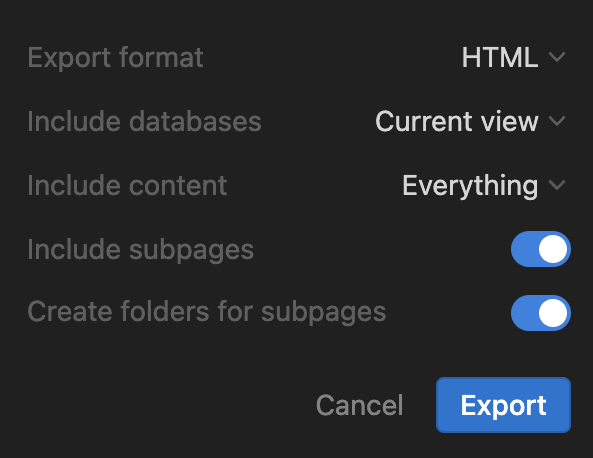

This Obsidian plugin allows you to import notes from other apps and file formats into your Obsidian vault. Notes are converted to plain text Markdown files.

## Supported formats

You can help! See our [Contribution guidelines](/CONTRIBUTING.md).

- [x] Evernote `.enex` (powered by [Yarle](https://github.com/akosbalasko/yarle))
- [x] HTML, folder of files
- [x] Notion, `.zip` of HTML files (thanks to @joshuatazrein)
- [x] Bear `.bear2bk` (thanks to @arthurtyukayev)
- [x] Google Keep (thanks to @daledesilva)
- [ ] Apple Notes
- [ ] Microsoft OneNote
- [ ] Roam Research
- [ ] Other Markdown flavors

## Usage

First install Importer in Obsidian → Community Plugins

### Import notes from Notion
- Export your Notion files to `HTML` format. You can export a whole top-level page or database from Notion by clicking **More actions** (`...` icon) and chose **Export.** Chose the following settings:

- Open the **Importer** plugin in Obsidian via the command palette or ribbon icon
- Under **File format** select **Notion (.html)**
- Choose the folder(s) of Notion notes you want to import. 
  - Select the unzipped folder(s), not anything inside of them.
  - **Note:** *It's recommended to import all your Notion at once so internal links can be reconciled correctly!*
- Select a folder for the import — your Notion pages and databases will be nested inside this folder.
- Click **Import**

### Import notes from Evernote

- Export your Evernote files to `.enex` format. You can export a whole notebook in the desktop client by going to the Notebooks screen, click on **More actions** (`...` icon) and choose **Export Notebook...**
- Open the **Importer** plugin in Obsidian via the command palette or ribbon icon
- Under **File format** select **Evernote (.enex)**
- Choose the `.enex` file you want to import
- Optionally, select a folder for the import — your Markdown files will be created in this folder within your vault.
- Click **Import**

Currently, the import does not have any special settings, if you want more control over the output, consider using [Yarle](https://github.com/akosbalasko/yarle).

### Import notes from HTML

- Open the **Importer** plugin in Obsidian via the command palette or ribbon icon
- Under **File format** select **HTML (.html)**
- Choose the HTML files or folders you want to import
- Optionally, select a folder for the import — your Markdown files will be created in this folder within your vault.
- Click **Import**

**Special settings**

- **Attachment size limit**: Skip importing attachments larger than the specified size.
- **Minimum image size**: Skip importing images smaller than the specified size in either dimension. Can be used to skip icons and logos.

## Contributing

This repo accepts contributions. Some issues have been [tagged with #bounty](https://github.com/obsidianmd/obsidian-importer/labels/bounty). See [Contribution guidelines](/CONTRIBUTING.md) for more information.

## Credits

This plugin relies on important contributions:

- [Yarle](https://github.com/akosbalasko/yarle) (MIT) by [@akosbalasko](https://github.com/akosbalasko) is used for `.enex` conversion, [support his work](https://www.buymeacoffee.com/akosbalasko)
