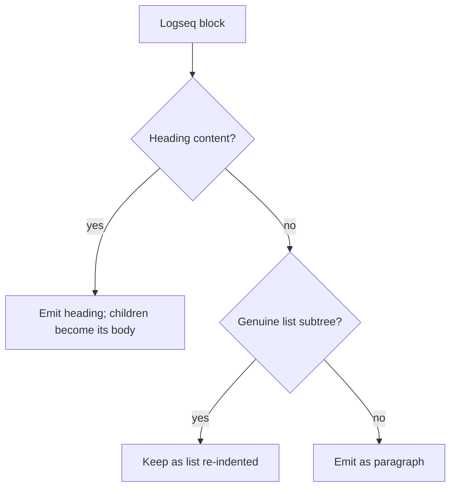
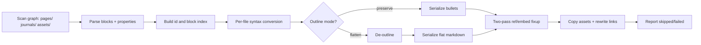

# Logseq to Obsidian Importer: Assessment and Roadmap

This document assesses what it would take to add a first-class **Logseq** importer to the
official [obsidian-importer](https://github.com/obsidianmd/obsidian-importer) plugin. Today
Logseq graphs can only be brought in via the generic "Markdown files" path, which ignores
the many Logseq-specific conventions. The goal here is a comprehensive, low-loss migration
of a Logseq markdown graph into an Obsidian vault.

Contents:

1. How an Obsidian importer works (the contract a new importer must satisfy)
2. Prior-art inventory: what existing tools already solve, and their gaps
3. Logseq vs Obsidian feature-mapping catalog
4. The outline problem and the configurable structure design
5. Handling of un-migratable / lossy features
6. Phased implementation roadmap
7. Declared limitations and conscious tradeoffs

---

## 1. How an Obsidian importer works

The importer is an Obsidian plugin. Each supported source app is an **importer class** that
extends a common base and is registered in a central map. Understanding this contract tells
us exactly what a Logseq importer must implement and which extension points are available
for resolving ambiguities through user options.

### 1.1 The `FormatImporter` contract

Every importer extends `FormatImporter` ([src/format-importer.ts](../src/format-importer.ts))
and is registered in `ImporterPlugin.importers` ([src/main.ts](../src/main.ts)). The two
methods that matter:

- `init()` — **abstract**. Builds the importer's UI inside the modal (file/folder pickers,
  output-folder field, and any option toggles/dropdowns). Called from the constructor.
- `import(ctx: ImportContext)` — **abstract**. Does the actual work: read input, convert,
  write into the vault, report progress.

Optional hooks: `showTemplateConfiguration(ctx, container)` for a pre-import wizard (only the
CSV importer uses it today), and `registerAuthCallback()` for OAuth-based importers
(OneNote, Notion API). A `notAvailable` flag lets an importer disable itself on unsupported
platforms (e.g. Apple Notes off macOS).

### 1.2 Built-in UI helpers (how options are exposed)

User-resolvable ambiguities are surfaced as Obsidian `Setting` widgets appended to
`this.modal.contentEl` inside `init()`. The base class provides:

- `addFileChooserSetting(name, extensions, allowMultiple?)` — desktop file/folder picker
  (Electron dialog); populates `this.files: PickedFile[]`. For Logseq we pick the **graph
  folder**.
- `addOutputLocationSetting(defaultFolderName)` — vault-relative output folder; stored in
  `this.outputLocation`.

Concrete option pattern, from the Roam importer ([src/formats/roam-json.ts](../src/formats/roam-json.ts)):

```ts
new Setting(this.modal.contentEl)
  .setName('Download all attachments')
  .addToggle(toggle => toggle.setValue(this.downloadAttachments).onChange(v => this.downloadAttachments = v));
```

Dropdowns (`addDropdown`), text fields (`addText`), and toggles (`addToggle`) are all used by
existing importers — this is how we will expose the outline mode, task-state strategy, etc.

### 1.3 Progress and results: `ImportContext`

`import(ctx)` receives an `ImportContext` ([src/main.ts](../src/main.ts)) used to drive the
progress UI and the final report:

- `ctx.status(message)` — current task label
- `ctx.reportProgress(current, total)` — progress bar
- `ctx.reportNoteSuccess(name)` / `ctx.reportAttachmentSuccess(name)`
- `ctx.reportSkipped(name, reason)` / `ctx.reportFailed(name, reason)`
- `ctx.isCancelled()` — checked in the import loop so the Stop button works

The `skipped`/`failed` collections are how we will surface un-migratable content (queries,
whiteboards, etc.) to the user rather than silently dropping it.

### 1.4 Writing into the vault

- `saveAsMarkdownFile(folder, title, content)` — sanitizes the title and creates the note.
- `vault.create(path, content)` / `vault.modify(file, content)` — used directly when paths
  are precomputed (Roam does this so it can build nested folders for namespaced pages).
- `createFolders(path)` — recursive folder creation.
- `getAvailablePathForAttachment(filename, claimedPaths)` — resolves a collision-free
  attachment path respecting the user's attachment-folder settings.
- `vault.createBinary(path, data)` — writes asset bytes.
- Filename safety: `sanitizeFileName()` ([src/util.ts](../src/util.ts)) and
  `sanitizeFileNameKeepPath()` ([src/formats/roam/utils.ts](../src/formats/roam/utils.ts),
  preserves `/` for nested page paths).

Cross-platform filesystem access is via [src/filesystem.ts](../src/filesystem.ts)
(`PickedFile`, `getAllFiles`, `parseFilePath`) and [src/zip.ts](../src/zip.ts); importers are
expected to use these instead of importing Node modules directly.

### 1.5 The closest existing models

- **Roam Research** ([src/formats/roam-json.ts](../src/formats/roam-json.ts)) is the nearest
  analogue: an outliner with nested bullets, `((block refs))`, daily notes, and `[[wikilinks]]`.
  Its **two-pass block-reference resolution** ([src/formats/roam/block-refs.ts](../src/formats/roam/block-refs.ts))
  — collect a `uid -> {page, text}` index, then rewrite `((uid))` into
  `[[page#^uid|text]]` and append `^uid` to the source line — is directly reusable for Logseq's
  `id::` / `((uid))` model. (Roam imports a single JSON export, though; Logseq is markdown on disk.)
- **Bear** ([src/formats/bear-bear2bk.ts](../src/formats/bear-bear2bk.ts)) and **Textbundle**
  ([src/formats/textbundle.ts](../src/formats/textbundle.ts)) are the models for **markdown
  files on disk plus an `assets/` folder**: copy assets via `getAvailablePathForAttachment` and
  rewrite the links. Logseq's layout is closer to these than to Roam's.

### 1.6 Tests and build

Tests run with the Node test runner: `pnpm test` → `tsx --test tests/**/*.test.ts`. The one
substantive suite is [tests/roam/block-refs.test.ts](../tests/roam/block-refs.test.ts), which
sweeps a fixture graph. Build is esbuild (`pnpm dev` watch, `pnpm build` production). A new
importer is a new file under `src/formats/` plus one entry in the `importers` map in
[src/main.ts](../src/main.ts).

```ts
// src/main.ts — registration shape
'logseq': {
  name: 'Logseq',
  optionText: 'Logseq',
  importer: LogseqImporter,
  helpPermalink: 'import/logseq',
},
```

---

## 2. Prior-art inventory

Three community tools live under [prior-art/](../prior-art/). Together they cover most of the
"easy" conversions; none does outline flattening or the harder Logseq-only features.

### 2.1 `laughedelic_outbreak` (Obsidian -> Logseq; the *opposite* direction)

TypeScript/Deno. Direction is reversed from ours, but it is the most valuable **specification**
because it documents the mappings carefully and implements a clean **outline model** that we
must *invert*.

- [prior-art/laughedelic_outbreak/syntax-differences.md](../prior-art/laughedelic_outbreak/syntax-differences.md)
  — authoritative catalog of task, date, priority, link, frontmatter, callout, embed, highlight,
  and numbered-list mappings (the basis of section 3).
- [prior-art/laughedelic_outbreak/structure-difference.md](../prior-art/laughedelic_outbreak/structure-difference.md)
  — defines the flat-markdown ↔ outline transform (the basis of section 4).
- `translate.ts` / `outline.ts` — syntax rules + a heading-stack outliner that turns flat
  markdown into nested bullets. Our de-outline mode is the inverse of this.

Useful as a reversible mapping spec; not runnable for our direction.

### 2.2 `sercxanto_logseq_to_obsidian` (Logseq -> Obsidian; most mature)

Python 3.9+, stdlib-only, spec-driven with good test coverage. **This is the parity bar for
our Phase 1.** Implemented today
([prior-art/sercxanto_logseq_to_obsidian/src/logseq_to_obsidian/transformer.py](../prior-art/sercxanto_logseq_to_obsidian/src/logseq_to_obsidian/transformer.py)):

- Page properties (first block) -> YAML frontmatter; wiki-link-valued properties quoted/listified.
- Tasks: `TODO/DOING/LATER/NOW/WAIT/WAITING/IN-PROGRESS` -> `- [ ]`, `DONE/CANCELED/CANCELLED` -> `- [x]`;
  priority `[#A/B/C]` and `SCHEDULED:`/`DEADLINE:`/repeaters -> emoji **or** Dataview metadata.
- Task date block-properties (`created`/`done`/`cancelled`) -> ➕/✅/❌ on the task line.
- Block `id::` -> `^id`; `((uuid))` -> `[[path#^uuid]]`; `{{embed}}`, `{{video}}`, `{{youtube}}`,
  `{{tweet}}` -> Obsidian equivalents.
- `[alias]([[Page]])` -> `[[Page|alias]]`; org-mode `#+BEGIN_*` -> callouts/quotes/`%%` comments;
  highlights `^^` -> `==`; numbered lists; LOGBOOK removal; `logseq.*` cleanup; asset images
  `` -> `![[x]]` (with `{:height,:width}` -> `|WxH|`).
- Path rules: `pages/Foo.md` -> `Foo.md`; `pages/a___b.md` -> `a/b.md`;
  `journals/2024_08_30.md` -> `2024-08-30.md` (optionally under a Daily Notes folder).

Gaps: no outline flattening; task workflow states collapsed to open/done; **wikilink text not
rewritten** for `___` namespaces (so `[[a___b]]` can dangle); no queries/flashcards/whiteboards;
percent-encoded filenames only warned about. CLI tool, not an Obsidian plugin.

### 2.3 `NishantTharani_LogSeqToObsidian` (Logseq -> Obsidian)

Single-file Python (`convert_notes.py`). Covers namespaces (`___`/`.`/`%2F`), journals,
properties, aliases, tags, code-blocks-in-lists, asset copy + image-resize syntax, and natural
-language date links. **Key cautionary lesson:** it *deletes* block references and embeds
(`re.sub(r"\(\(.*?\)\)", "", line)`) — real data loss we must avoid. Also collapses task states,
flattens assets to basename (collision risk), and leaves LOGBOOK/SCHEDULED/DEADLINE untouched.
The bundled `bonofix-snippet.css` is cosmetic only.

### 2.4 Coverage summary

- Solved well by prior art (reuse the logic): properties->frontmatter, tasks + dates, links/aliases,
  block id/refs/embeds (sercxanto), org blocks, highlights, numbered lists, asset images,
  namespaces/journals path mapping.
- Partially solved / inconsistent: task **state preservation**, namespace **wikilink** rewriting,
  percent-encoded filenames, asset collision handling.
- Not attempted by anyone: **outline flattening**, queries, flashcards, PDF highlights, whiteboards,
  templates/macros.

---

## 3. Logseq vs Obsidian feature-mapping catalog

Legend for **Loss**: *None* (round-trips), *Minor* (cosmetic/normalization), *Lossy* (information
discarded by design), *Drop* (content not migratable, preserved verbatim or skipped).
**Option** marks rows where behavior should be user-configurable.

### 3.1 Document structure / outline

| Logseq | Obsidian target | Loss | Proposed handling |
|---|---|---|---|
| Every block is a `- ` bullet; hierarchy via indentation | Preserve bullets OR flatten to paragraphs/headings | None (preserve) / Lossy (de-outline) | **Option** — see section 4 |
| Block that is a heading (`- # Title` or `heading::` prop) | `# Title` | Minor | De-nest when de-outlining; keep `- # Title` when preserving |
| Heading followed by tab-indented child list | `- # Heading` + list | None | Keep sercxanto's `fix_heading_child_lists` so Obsidian doesn't render children as code/quote |

### 3.2 Tasks

Obsidian has **no built-in task management** beyond native checkboxes (`[ ]` and `[x]` only).
Rich tasks come from community plugins, and there are **three viable target formats** the user
should be able to choose between. This is the single most consequential option in the importer
because Logseq tasks carry a lot of metadata (state, priority, scheduled/deadline, repeater,
LOGBOOK time tracking) that maps very differently into each target.

#### 3.2.1 The three target formats

1. **Tasks plugin — emoji format** ([publish.obsidian.md/tasks](https://publish.obsidian.md/tasks)).
   Tasks stay inline as checkbox list items; metadata is appended as emoji + date. Most common,
   visually compact.
2. **Tasks plugin — Dataview/inline-field format**. Same inline checkbox, but metadata written as
   `[key:: value]` inline fields instead of emoji. More readable/queryable, requires Dataview.
3. **TaskNotes** ([tasknotes.dev](https://tasknotes.dev/)). Each task becomes its **own markdown
   file** with structured metadata in **YAML frontmatter**, queried via the **Bases** core plugin
   ([obsidian.md/help/bases](https://obsidian.md/help/bases)). Has native **time tracking**
   (`timeEntries` array) ([time management](https://tasknotes.dev/features/time-management/)).

A fourth, always-available baseline is **plain checkboxes** (no plugin): just `- [ ]` / `- [x]`,
discarding rich metadata into text — the safe lowest-common-denominator default.

#### 3.2.2 Mapping per target

| Logseq | Plain | Tasks (emoji) | Tasks (Dataview) | TaskNotes (frontmatter) |
|---|---|---|---|---|
| `TODO` / `LATER` | `- [ ]` | `- [ ]` | `- [ ]` | `status: open` |
| `DOING` / `NOW` | `- [ ]` | `- [/]` | `- [/]` | `status: in-progress` |
| `DONE` | `- [x]` | `- [x] ✅ <date>` | `- [x] [completion:: date]` | `status: done` |
| `CANCELLED` | `- [x]` | `- [-]` | `- [-]` | `status: cancelled` |
| `WAITING` / `IN-PROGRESS` | `- [ ]` | `- [ ]` (+`#waiting`) | `- [ ]` | custom `status:` value |
| priority `[#A/B/C]` | text | 🔺/⏫ , 🔼 , 🔽/⏬ | `[priority:: high/medium/low]` | `priority: high/normal/low` |
| `SCHEDULED: <date>` | text | `⏳ date` | `[scheduled:: date]` | `scheduled: date` |
| `DEADLINE: <date>` | text | `📅 date` | `[due:: date]` | `due: date` |
| repeater `.+1d`/`++2w` | drop | `🔁 every N unit` | `[repeat:: …]` | `recurrence:` (RRULE) |
| `created/done/cancelled` props | text | ➕ / ✅ / ❌ date | inline fields | frontmatter dates |
| `:LOGBOOK:`/`CLOCK:` time tracking | drop | drop (no target) | drop | `timeEntries:` array |

#### 3.2.3 Viability and limitations of each path

- **Plain checkboxes** — trivial, fully lossless on structure, but discards almost all task
  metadata into prose. Good default; bad for power users.
- **Tasks plugin (emoji)** — *most straightforward*. A **line-level** transform: each Logseq task
  block becomes one checkbox line; the outline structure is untouched. This is essentially what
  outbreak/sercxanto already implement, so we have a proven mapping. Limits: 3->5 priority
  remap is lossy in reverse; no place for LOGBOOK time tracking (dropped); custom states
  (WAITING) need a tag or a custom Tasks status.
- **Tasks plugin (Dataview)** — same line-level transform and same low risk; just a different
  serialization of the same fields. Slightly better for querying. Same LOGBOOK gap.
- **TaskNotes** — *most powerful but most invasive*. Each task must be **extracted into a
  separate note file** with frontmatter, and the original block replaced by a link/embed.
  Strong wins: rich metadata maps cleanly (status/priority/scheduled/due/recurrence), Logseq
  **LOGBOOK `CLOCK:` entries map directly onto TaskNotes `timeEntries`** (start/end pairs), and
  Logseq queries can be re-expressed as **Bases** views. Costs and limitations: it breaks the
  in-outline context of a task (a task that had child blocks/notes underneath now lives in its
  own file — those children must be moved into the task note body or left behind with a link);
  it can explode a journal-heavy graph into thousands of tiny files; it depends on two plugins
  (TaskNotes + Bases core plugin, Obsidian 1.10.1+). Best offered as an explicit opt-in for users
  who are committing to the TaskNotes workflow, not the default.

**Recommendation:** default to **Tasks plugin (emoji)** (proven, line-level, low risk), offer
plain/Dataview/TaskNotes as alternatives via a dropdown. Implement emoji + Dataview + plain in
Phase 1 (they share the same per-line pipeline); implement TaskNotes in a later phase because it
needs the separate-file extraction machinery and is the only path that can preserve LOGBOOK time
tracking.

### 3.3 Links, references, embeds

| Logseq | Obsidian target | Loss | Proposed handling |
|---|---|---|---|
| `[[Page]]` (canonical name) | `[[Page]]` | None | Rewrite `[[a/b]]` namespace text to match output path |
| `[[Alias]]` (reference *by alias*) | `[[Canonical\|Alias]]` | None | See alias note below — must rewrite to canonical target |
| `[alias]([[Page]])` | `[[Page\|alias]]` | None | Skip inside code fences |
| `id:: <uuid>` block property | `^shortid` appended to the block line | None | Shorten UUID (see 5.2); reuse Roam approach; never delete |
| `((uuid))` block reference | `[[Page#^shortid]]` | None if resolved | Build a vault-wide id index first; unresolved -> keep raw + warn |
| `{{embed ((uuid))}}` | `![[Page#^shortid]]` | None if resolved | After ref pass |
| `{{embed [[Page]]}}` | `![[Page]]` | None | |
| `#tag` / `#[[multi word]]` | `#tag` / `#multi-word` or `[[...]]` | Minor | **Option** keep tag vs convert to link; sanitize spaces |
| Namespace page file `a___b.md` | `a/b.md` (folders) | None | Also rewrite link text and aliases that reference it |
| Percent-encoded filename (`Encoded%3AColon.md`) | decoded title `Encoded:Colon` -> sanitized | Minor | Decode (improve over prior art which only warns) |

**Aliases are not interchangeable between the two apps.** Both have a page-level alias property,
but they behave differently:

- In **Logseq** ([alias docs](https://docs.logseq.com/#/page/term%2Falias)), an alias is a true
  alternate name: you can write `[[Some Alias]]` anywhere and Logseq resolves it to the canonical
  page.
- In **Obsidian** ([alias docs](https://obsidian.md/help/aliases)), aliases only feed autocomplete
  and search/display; a link's target in the file is always the **canonical note name**. Writing
  `[[Some Alias]]` would point at a (possibly non-existent) note literally called "Some Alias", not
  the canonical page.

Therefore the importer must, in its link-resolution pass, build an **alias -> canonical-page map**
from every page's `alias::`/`aliases::` property, and rewrite any reference that targets an alias
into `[[Canonical Page|Alias]]` (keeping the alias as display text). The alias values themselves
still go into the note's `aliases:` frontmatter so Obsidian autocomplete keeps working. (Nishant's
tool does a basename-only version of this; we do it with full namespace paths.) Ambiguous aliases
(same alias claimed by multiple pages) are reported via `ctx.reportSkipped` and left as-is.

### 3.4 Properties

| Logseq | Obsidian target | Loss | Proposed handling |
|---|---|---|---|
| Page properties (first block, `key:: value`) | YAML frontmatter | None | `alias`->`aliases`, `tags::`->`tags`, strip `#`, parse `[[..]]`, quote wiki-link values |
| `title::` | drop; use as filename if differs (warn) | Minor | Logseq filename is source of truth |
| `collapsed:: true` | removed | None | Fold state is not file-level in Obsidian |
| `id::` | -> `^id` (see 3.3) | None | |
| `heading:: N` | `#`×N prefix on the block | Minor | |
| `logseq.order-list-type:: number` | numbered list (see 3.5) | None | |
| `query-table::`, `query-sort-*::`, `filters::`, `public::` | drop or keep raw | Lossy | Logseq-internal; **Option** drop vs keep as `key:: value` |
| Other block properties (`key:: value`, non-first block) | keep as inline text OR Dataview `[key:: value]` | Minor | **Option**; default keep as-is |

### 3.5 Inline syntax and blocks

| Logseq | Obsidian target | Loss | Proposed handling |
|---|---|---|---|
| `^^highlight^^` | `==highlight==` | None | Skip code fences |
| `#+BEGIN_QUOTE` … `#+END_QUOTE` | `> ` blockquote | None | |
| `#+BEGIN_NOTE/TIP/WARNING/IMPORTANT/CAUTION/EXAMPLE` | `> [!type]` callout | Minor | First `**bold**` line -> callout title |
| `#+BEGIN_COMMENT` | `%% … %%` | None | |
| `#+BEGIN_CENTER/VERSE/PINNED` | `> [!note]` fallback | Lossy | No native equivalent |
| numbered list (bullet + `logseq.order-list-type:: number`) | `1.` `2.` `3.` | None | Counter per indent level |
| code fences in bullets | code fence (indent fixed) | None | Reuse sercxanto/Nishant fix |
| `$inline$` / `$$block$$` math | unchanged | None | Both support MathJax |

### 3.6 Media / assets

| Logseq | Obsidian target | Loss | Proposed handling |
|---|---|---|---|
| `` | `![[x.png]]` (copied via attachment settings) | Minor (alt) | **Option** keep alt as `![[x\|alt]]`; copy bytes, avoid name collisions |
| `{:height H, :width W}` | `![[x.png\|WxH]]` | None | |
| `{{video URL}}` / `{{youtube URL}}` | `` | None | |
| `{{tweet URL}}` | `` | Minor | |
| local non-image asset link | `![[file.ext]]` or `[[file.ext]]` | None | Copy bytes |

### 3.7 Journals / daily notes

Journals are a first-class part of Logseq and must be migrated carefully. The migration has two
distinct format ends, and **neither should be assumed blindly**:

- **Source (Logseq):** the on-disk filename format `:journal/file-name-format` (default
  `yyyy_MM_dd`) and the in-content date-link format `:journal/page-title-format` (default
  `MMM do, yyyy`, e.g. `Jan 19th, 2038`). Both live in `logseq/config.edn`, so the importer should
  **read `config.edn`** rather than hard-code defaults, and fall back to defaults only if absent.
- **Target (Obsidian):** the daily-note filename format and folder are user-configurable in the
  **Daily Notes** core plugin (and may be overridden by the **Periodic Notes** plugin). The Roam
  importer already reads this via `app.internalPlugins.getPluginById('daily-notes').instance`
  (default `YYYY-MM-DD`). We do the same, and additionally expose the format/folder as overridable
  options so users whose target setup differs (or isn't configured yet) aren't surprised.

| Logseq | Obsidian target | Loss | Proposed handling |
|---|---|---|---|
| `journals/2024_08_30.md` (format from `:journal/file-name-format`) | daily-note path from Daily Notes/Periodic Notes config | None | Read both configs; **Option** to override format + folder |
| `[[Jan 19th, 2038]]` date link (`:journal/page-title-format`) | `[[2038-01-19]]` (target daily-note format) | None | Parse source format from config; reformat to target |

#### Optional, more ergonomic targets

Beyond the core Daily Notes plugin, two community plugins offer journal experiences closer to
Logseq's, and the importer can optionally target them:

- **Periodic Notes** ([github](https://github.com/liamcain/obsidian-periodic-notes)) — adds
  weekly/monthly/quarterly/yearly notes. If a Logseq graph uses weekly/monthly journal pages (via
  custom title formats), we can route them to the matching Periodic Notes folders/formats instead
  of flattening everything into daily notes.
- **Moments** ([community plugin](https://community.obsidian.md/plugins/moments)) — unifies dated
  content as inline dated headings (`### [[2026-02-10]] ...`) and a timeline. A potential opt-in for
  users who prefer dated entries embedded in topical notes rather than standalone daily files; it
  auto-detects the Daily Notes/Periodic Notes date format, so our output stays compatible.

These are **opt-in** targets (a journal-target dropdown: Daily Notes (default) / Periodic Notes /
Moments-style). v1 implements Daily Notes; Periodic/Moments routing is a later enhancement.

---

## 4. The outline problem and the configurable structure design

This is the central design decision. Logseq treats **every** document as an outline of nested
blocks; indentation *is* the structure. Obsidian uses flat markdown where headings only imply
structure visually. (See
[structure-difference.md](../prior-art/laughedelic_outbreak/structure-difference.md).)

Per the agreed decision, structure handling is a **user-selectable option**, defaulting to
**Preserve**. Both paths apply all of the section-3 syntax conversions; they differ only in how
the block tree is serialized.

### 4.1 Preserve mode (default)

Keep every block as a `- ` bullet with its original indentation. This is exactly what sercxanto
and Nishant do, and it is **lossless** — the structure that the user built in Logseq survives
intact. The only structural touch-up is the heading/child-list fix (3.1) so headings with
indented children render correctly. Trade-off: notes remain "outliner-shaped" in Obsidian
(everything is a bullet), which some users dislike.

### 4.2 De-outline mode (opt-in)

Produce idiomatic flat markdown by inverting outbreak's outliner (`outline.ts`). Proposed
heuristics:

- A **top-level** bullet that contains prose (not part of a real sub-list) becomes a paragraph;
  blank line between paragraphs.
- A bullet whose content is a heading (`# …` or `heading::`) de-nests to a real heading; its
  children become the following content at the heading's implied level.
- A subtree that is a **genuine list** (multiple sibling leaf items under a stem) stays a list,
  re-indented from its outline depth.
- Block properties and task dates that were on child lines move inline onto their block.
- Single-child chains collapse (avoid one-item lists).



Lossy edge cases to document: a list "incidentally" nested under a paragraph loses that
parent-child link; deeply mixed prose/list trees may not flatten cleanly; block references that
pointed at structural bullets still resolve (we keep `^id` anchors regardless of mode). Because
of this, de-outline is **opt-in**, never the default.

### 4.3 Scope: pages vs journals

De-outlining is not equally desirable everywhere. **Pages** are often long-form notes where flat
markdown reads better, while **journals** are typically genuine bullet logs where the outline *is*
the content and flattening would look wrong. So the de-outline choice has a **scope** sub-option:

- `pages` — flatten pages only, keep journals as outlines (recommended when de-outlining)
- `journals` — flatten journals only
- `both` — flatten everything

The default remains **Preserve everywhere**. When the user opts into de-outline, the default scope
is **pages only**.

### 4.4 Exposure

Two linked settings in `init()`:

```ts
new Setting(this.modal.contentEl)
  .setName('Document structure')
  .setDesc('How to handle Logseq\'s outline (everything-is-a-bullet) model')
  .addDropdown(d => d
    .addOption('preserve', 'Preserve outline (bullets) — recommended')
    .addOption('flatten', 'Flatten to paragraphs and headings (experimental)')
    .setValue('preserve'));

// shown only when 'flatten' is selected
new Setting(this.modal.contentEl)
  .setName('Flatten scope')
  .addDropdown(d => d
    .addOption('pages', 'Pages only — keep journals as outlines')
    .addOption('journals', 'Journals only')
    .addOption('both', 'Pages and journals')
    .setValue('pages'));
```

---

## 5. Handling of un-migratable / lossy features

Guiding rule: **never silently delete content.** Anything we cannot faithfully convert is either
preserved verbatim (so the text survives) or skipped with an explicit `ctx.reportSkipped` /
`reportFailed` entry so the user knows. This is the main correctness improvement over Nishant's
tool (which deletes block refs outright).

### 5.1 Keep-or-drop is configurable per feature

Every feature that is Logseq-only **and** has no good Obsidian translation — or that simply becomes
irrelevant after migration — gets an explicit **keep / drop** choice. "Keep" preserves the original
text verbatim (so nothing is lost and the user can revisit it); "drop" removes it **cleanly** (no
empty bullets, dangling lines, or leftover markers). The default per feature is chosen to be the
least surprising, but the user can flip any of them. A single grouped setting (e.g. a small list of
toggles, or one "Logseq-only content" dropdown of `keep` / `drop`) exposes these.

| Feature | On-disk syntax | Default | If kept | If dropped (clean) |
|---|---|---|---|---|
| Simple queries | `{{query ...}}` | keep | verbatim in a fenced code block + warn | remove block, no residue |
| Advanced queries | `#+BEGIN_QUERY … #+END_QUERY` | keep | verbatim code block + warn | remove block |
| Flashcards | `#card`, `{{cloze ...}}` | keep | keep block text + `#card`; drop SRS schedule | unwrap cloze to plain text |
| PDF highlights/annotations | `logseq.property.pdf/*` | keep | keep text + warn (geometry lost) | remove annotation blocks |
| Whiteboards | `whiteboards/*.edn` | drop | copy `.edn` as an asset + warn | skip file (reported) |
| Templates | `template::` property | keep | keep block as a normal note + warn | skip template page |
| Macros / dynamic vars | `{{macro ...}}`, `<% %>` | keep | verbatim + warn | remove macro call |
| `collapsed::`, `logseq.*`, `query-*::` props | block/page props | drop | keep as `key:: value` | strip line cleanly |

Alternative (future) targets — Dataview for queries, a spaced-repetition plugin for flashcards,
PDF++/Annotator for PDF highlights, Obsidian Canvas for whiteboards — are out of scope for v1.

`logseq/`, `.recycle/`, `.git/`, and the Markdown-mirror folder are ignored during the scan.

### 5.2 Block references: shorten the IDs

Logseq block IDs are full UUIDs (e.g. `64ab9aa4-459a-41b1-8c21-dbb38dc0c79b`). Obsidian block
identifiers are much shorter and have a restricted charset: they may contain only **letters,
numbers, and dashes**, and Obsidian's own UI generates short ~6-character alphanumeric IDs (e.g.
`^a1b2c3`). Carrying the full UUID as `^64ab9aa4-...` works but is ugly and noisy in the rendered
note and in the `[[Page#^64ab9aa4-...]]` links.

Proposed handling: when converting `id:: <uuid>` to an Obsidian `^anchor`, **shorten** the UUID to
a short, stable, collision-checked ID:

- Derive a short id deterministically from the UUID (e.g. first 6–8 hex chars, or a short hash) so
  the mapping is stable across the run.
- Maintain a `uuid -> shortid` map; on collision **within the same note** (Obsidian only requires
  per-note uniqueness for `^` anchors), extend by one character until unique.
- Rewrite both the anchor (`^shortid`) and every `((uuid))` reference / `{{embed ((uuid))}}` through
  the same map, so links stay consistent.
- **Option** to keep the full UUID for users who prefer guaranteed-stable identifiers.

This keeps the output idiomatic while preserving every reference (improving on prior art that
either deletes refs or leaves long UUIDs inline).

---

## 6. Phased implementation roadmap

### 6.1 Pipeline



A two-pass design is required because `((uuid))` references can point at blocks in other files,
so the full id index must be built before link rewriting (same shape as the Roam importer).

### 6.2 Phases

**Phase 0 — Scaffold.**
- `src/formats/logseq.ts` extending `FormatImporter`; register `'logseq'` in
  [src/main.ts](../src/main.ts).
- `init()`: graph-folder picker, output-folder setting, and options:
  - **Task format**: plain / Tasks-emoji (default) / Tasks-Dataview / TaskNotes (3.2)
  - **Document structure**: preserve (default) / flatten, plus flatten **scope** pages/journals/both (4.4)
  - **Journal target**: Daily Notes (default) / Periodic Notes / Moments-style, with format+folder overrides (3.7)
  - **Logseq-only content**: keep (default) / drop per feature group (5.1)
  - **Block IDs**: shorten (default) / keep full UUID (5.2)
  - copy-assets, properties->frontmatter, tag-vs-link toggles
- Walk `pages/` + `journals/`; skip `logseq/`, `whiteboards/`, `.recycle/`, mirror.

**Phase 1 — Core lossless conversion (reach sercxanto parity in Preserve mode).**
- Page properties -> YAML frontmatter (alias/tags/wiki-link quoting; drop `title::`/`collapsed::`).
- Tasks (plain + Tasks-emoji + Tasks-Dataview) + priorities + SCHEDULED/DEADLINE/repeaters + task
  date props; LOGBOOK keep/drop.
- Links: `[[page]]`, `[alias]([[page]])` -> `[[page|alias]]`; `#tag`/`#[[..]]`; **alias-reference
  rewriting** to canonical (3.3).
- Block `id::` -> shortened `^id`; `((uuid))`/`{{embed}}` two-pass resolution through the shared
  id map (reuse [src/formats/roam/block-refs.ts](../src/formats/roam/block-refs.ts) logic).
- Org blocks -> callouts/quote/comment; highlights; numbered lists; code-in-list fix.
- Assets: copy via `getAvailablePathForAttachment`, rewrite `![[..]]`, handle `{:height,:width}`.
- Namespaces (`a___b.md` -> `a/b.md`) incl. **wikilink** rewriting; journal filename/date conversion
  reading `config.edn` and the Daily Notes plugin config.

**Phase 2 — Structure + fidelity improvements.**
- De-outline (flatten) mode (4.2) with heading fixes and the pages/journals/both scope (4.3).
- Configurable task-state preservation (custom states / tags).
- Percent-encoded filename decoding.

**Phase 3 — Logseq-only features + richer targets.**
- Queries / flashcards / templates / macros: keep-verbatim or clean-drop + `reportSkipped` (5.1).
- **TaskNotes** target: extract tasks into per-task notes with YAML frontmatter, map LOGBOOK
  `CLOCK:` -> `timeEntries`, recurrence -> `recurrence`, and optionally a Bases view (3.2).
- **Periodic Notes / Moments** journal targets (3.7).
- Whiteboards keep-as-asset or skip.

### 6.3 TDD workflow

The implementation follows test-driven development: **write the unit tests first**, then implement
until green. End-to-end tests come later.

1. For each feature row in section 3, write a focused **unit test** (input snippet -> expected
   output) against a small pure transform function, before writing that transform. Tests start red.
2. Implement the transform until its tests pass; refactor with tests green.
3. Keep transforms as small, pure, independently testable functions (mirrors sercxanto's
   `transformer.py` and outbreak's `translate.ts` rule list), so each is unit-testable without a
   running Obsidian/vault.
4. Only after a phase's units are green, add **end-to-end** tests that run the whole importer over a
   fixture graph and assert the output tree.

### 6.4 Test assets and harness

- Unit tests: Node test runner, following [tests/roam/block-refs.test.ts](../tests/roam/block-refs.test.ts).
  One file per transform group (tasks, links/aliases, properties, blocks, assets, journals, outline).
- Fixtures: reuse the example vaults already in this repo as inputs —
  [prior-art/NishantTharani_LogSeqToObsidian/example/logseq_vault](../prior-art/NishantTharani_LogSeqToObsidian/example/logseq_vault)
  and [prior-art/sercxanto_logseq_to_obsidian/tests/fixtures/logseq/basic](../prior-art/sercxanto_logseq_to_obsidian/tests/fixtures/logseq/basic)
  — and add small targeted fixtures for cases they miss (alias references, block-id shortening,
  de-outline scope, TaskNotes extraction).
- End-to-end (later): convert a fixture graph and assert the output tree, that block refs resolve,
  and that nothing is silently dropped.

---

## 7. Declared limitations and conscious tradeoffs

Intentionally **out of scope for v1** (text preserved, never silently lost):

- Query translation to Dataview (queries preserved verbatim).
- Flashcard/SRS scheduling, PDF area-highlight geometry, whiteboards (skipped + reported).
- Templates/macros/dynamic-variable execution (preserved verbatim).
- The Logseq **DB graph** format — we target the **markdown/file-based** graph only.

Accepted, documented information loss:

- Task **workflow** states beyond open/done are collapsed unless the preserve-state option is on.
- Priority granularity collapses from Logseq's 3 levels to the chosen Obsidian scheme.
- **LOGBOOK / `CLOCK:` time tracking** has no target in the Tasks-plugin or plain paths and is
  dropped there; it is **only preserved on the TaskNotes path** (-> `timeEntries`).
- De-outline mode is heuristic and may restructure incidental list/paragraph nesting; this is
  why **Preserve is the default** (and pages-only when enabled).

Key decisions made configurable (not assumed):

- **Task format** is user-chosen among plain / Tasks-emoji (default) / Tasks-Dataview / TaskNotes.
- Every **Logseq-only feature** can be kept (verbatim) or dropped cleanly (5.1).
- **Journal date formats** are read from `config.edn` (source) and the Daily Notes/Periodic Notes
  config (target), with manual overrides — never hard-coded.
- **Block IDs** are shortened to Obsidian-style short anchors by default, with an option to keep
  full UUIDs (5.2).

Correctness guarantees we commit to:

- Block references are always either resolved or kept raw — **never deleted** (unlike Nishant).
- **Alias references** are rewritten to canonical targets so links don't break in Obsidian (3.3).
- Assets are de-duplicated on import (no basename collisions).
- Unconvertible content is reported to the user via `ImportContext`, not dropped silently.
